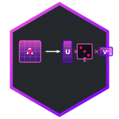

<p align="center">
  
</p>

# CrucibleFactorization

<p align="center">
  <a href="https://github.com/North-Shore-AI/crucible_factorization/actions/workflows/ci.yml">
    
  </a>
  <a href="https://github.com/North-Shore-AI/crucible_factorization/blob/main/LICENSE">
    
  </a>
</p>

Nx SVD/SVF factorization primitives for model surgery and artifact export.

This package is intentionally narrow. It owns numerical factorization,
reconstruction, tensor traversal, manifest helpers, and router-vector splitting.
It avoids provider, tracing, orchestration, and application runtime dependencies.
Callers that use product-specific artifact names should pass those names
explicitly at the API boundary.

## What It Provides

- `CrucibleFactorization.SVD.thin/2` and `thin!/2` run reduced SVD with timing,
  backend, rank, and sync metadata.
- `CrucibleFactorization.SVD.reconstruct/3` rebuilds tensors from SVD
  components and scale offsets.
- `CrucibleFactorization.SVD.decompose_tensors/2`,
  `reconstruct_tensors/3`, and `adapt_tensors/3` operate on selected tensor
  entries from nested parameter trees.
- `CrucibleFactorization.SVF` provides low-rank singular-vector-field helpers
  for `base_tensor + low_rank_delta` workflows.
- `CrucibleFactorization.StageCheck` and `ParityReport` provide math-only
  tensor comparison summaries.
- `CrucibleFactorization.SVD.load_router_vector!/2` and
  `split_router_vector/4` load and split a flat vector into scale offsets and
  dense head weights. The default tensor name is the generic `"router_vector"`.

## Installation

If [available in Hex](https://hex.pm/docs/publish), the package can be installed
by adding `crucible_factorization` to your list of dependencies in `mix.exs`:

```elixir
def deps do
  [
    {:crucible_factorization, "~> 0.1.0"}
  ]
end
```

Documentation can be generated with [ExDoc](https://github.com/elixir-lang/ex_doc)
and published on [HexDocs](https://hexdocs.pm). Once published, the docs can
be found at <https://hexdocs.pm/crucible_factorization>.

## Thin SVD

```elixir
alias CrucibleFactorization.SVD

matrix = Nx.tensor([[2.0, 4.0], [1.0, 2.0]], type: :f32)

{:ok, result} = SVD.thin(matrix, rank: 1, compute_type: :f32, force_sync?: true)
reconstructed = SVD.reconstruct(result, Nx.broadcast(0.0, {result.rank}))
```

`result` includes `:u`, `:s`, `:v`, `:rank`, source type, backend label,
decompose timing, and optional force-sync timing.

## SVF Delta Reconstruction

```elixir
alias CrucibleFactorization.SVF

base = Nx.tensor([[1.0, 1.0], [1.0, 1.0]], type: :f32)
delta = Nx.tensor([[2.0, 4.0], [1.0, 2.0]], type: :f32)

{:ok, svf} = SVF.decompose(delta, rank: 1)
{:ok, adapted} = SVF.reconstruct(base, svf)
```

## Tensor Traversal

```elixir
entries =
  params
  |> SVD.decomposable_tensor_entries(path_filter: SVD.layer_index_filter([26]))

manifest = SVD.tensor_manifest(entries)
count = SVD.singular_value_count(entries)
```

The helpers accept generic nested maps, lists, tuples, and structs with a
`:data` field. They do not require a framework runtime struct.

## Router Vector Helpers

```elixir
vector = SVD.load_router_vector!("router_vector.safetensors")

split =
  SVD.split_router_vector(
    vector,
    scale_count,
    hidden_size,
    output_count
  )

split.scale_offsets
split.head_weights
```

For product-specific safetensors keys, pass the key explicitly:

```elixir
vector = SVD.load_router_vector!("artifact.safetensors", "product_router_vector")
```

## Backend And Sync Options

`thin/2` accepts:

- `:rank` for reduced rank selection.
- `:compute_type`, either `:source` or `:f32`.
- `:backend` for `Nx.backend_transfer/2`.
- `:force_sync?` and `:sync_fun` for timing asynchronous backends.

## CI

```sh
mix ci
```

CUDA is opt-in:

```sh
XLA_TARGET=cuda12 mix test --only cuda
```

`mix ci` runs dependency fetch, format check, warning-as-error compile, tests,
Credo strict, Dialyzer, and docs generation.
